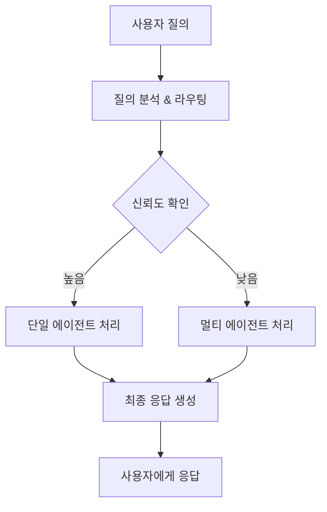

# 🤖 통합 에이전트 시스템

5개의 전문 AI 에이전트를 LangGraph를 사용하여 통합한 시스템입니다. 사용자의 질의를 자동으로 분석하여 가장 적절한 에이전트로 라우팅합니다.

## 📋 지원하는 에이전트

| 에이전트 | 포트 | 전문 분야 |
|---------|------|----------|
| 💼 **비즈니스 플래닝** | 8001 | 창업 준비, 사업 계획, 시장 조사, 투자 유치 |
| 🤝 **고객 서비스** | 8002 | 고객 관리, 서비스 개선, 고객 만족도 향상 |
| 📢 **마케팅** | 8003 | 마케팅 전략, SNS 마케팅, 브랜딩, 광고 |
| 🧠 **멘탈 헬스** | 8004 | 스트레스 관리, 심리 상담, 멘탈 케어 |
| ⚡ **업무 자동화** | 8005 | 일정 관리, 이메일 자동화, 생산성 도구 |

## 🚀 시작하기

### ⚡ 빠른 시작 (추천)

```bash
# 원클릭 전체 설치 및 실행
chmod +x quick_start.sh
./quick_start.sh
```

### 🔧 의존성 충돌 해결

**버전 충돌 문제가 발생하면:**

```bash
# 방법 1: 원클릭 해결 (가장 빠름)
chmod +x easy_install.sh
./easy_install.sh

# 방법 2: 단계별 해결
chmod +x solve_conflicts.sh
./solve_conflicts.sh

# 방법 3: 자동 진단
python check_dependencies.py
```

**상세한 가이드:** [CONFLICT_RESOLUTION.md](CONFLICT_RESOLUTION.md) 참고

### 1. 환경 설정

```bash
# 의존성 설치 (여러 옵션 제공)
./install_dependencies.sh

# 환경 변수 설정
cp .env.template .env
# .env 파일을 편집하여 API 키와 설정값 입력
```

### 2. 각 에이전트 서버 실행

각 에이전트를 별도 터미널에서 실행해야 합니다:

```bash
# 비즈니스 플래닝 에이전트 (포트 8001)
cd ../buisness_planning_agent
uvicorn business_planning:app --host 0.0.0.0 --port 8001

# 고객 서비스 에이전트 (포트 8002)  
cd ../customer_service_agent
uvicorn customer_agent.main:app --host 0.0.0.0 --port 8002

# 마케팅 에이전트 (포트 8003)
cd ../marketing_agent
uvicorn rag:app --host 0.0.0.0 --port 8003

# 멘탈 헬스 에이전트 (포트 8004)
cd ../mental_agent
uvicorn main:app --host 0.0.0.0 --port 8004

# 업무 자동화 에이전트 (포트 8005)
cd ../task_agent
uvicorn main:app --host 0.0.0.0 --port 8005
```

### 3. 통합 시스템 실행

```bash
# 통합 에이전트 시스템 실행 (포트 8000)
python main.py
```

## 📡 API 사용법

### 통합 질의 처리

```python
import requests

# 질의 요청
response = requests.post("http://localhost:8000/query", json={
    "user_id": 1,
    "message": "창업을 준비하고 있는데 사업계획서 작성 방법을 알려주세요",
    "conversation_id": 123
})

result = response.json()
print(f"라우팅된 에이전트: {result['agent_type']}")
print(f"응답: {result['response']}")
```

### 시스템 상태 확인

```python
import requests

# 헬스체크
health = requests.get("http://localhost:8000/health")
print(health.json())

# 에이전트 정보
agents = requests.get("http://localhost:8000/agents")
print(agents.json())
```

## 🔄 워크플로우



## 🎯 라우팅 로직

시스템은 다음 방식으로 적절한 에이전트를 선택합니다:

1. **키워드 매칭**: 미리 정의된 키워드 기반 빠른 매칭
2. **LLM 분석**: OpenAI/Gemini를 사용한 의도 분석
3. **신뢰도 검증**: 라우팅 결정의 신뢰도 평가
4. **폴백 처리**: 낮은 신뢰도 시 기본 에이전트 사용

## 📊 예시 질의와 라우팅

| 질의 예시 | 라우팅 대상 | 신뢰도 |
|----------|------------|--------|
| "창업 아이디어를 검증하고 싶어요" | 비즈니스 플래닝 | 0.95 |
| "고객 불만 처리 방법은?" | 고객 서비스 | 0.92 |
| "인스타그램 마케팅 전략 추천해주세요" | 마케팅 | 0.98 |
| "요즘 스트레스가 너무 심해요" | 멘탈 헬스 | 0.89 |
| "회의 일정을 자동으로 잡아주세요" | 업무 자동화 | 0.91 |

## 🛠️ 설정 옵션

### .env 파일 주요 설정

```bash
# 라우팅 설정
ROUTING_CONFIDENCE_THRESHOLD=0.8  # 라우팅 신뢰도 임계값
ENABLE_MULTI_AGENT=true           # 멀티 에이전트 모드 활성화
MAX_ALTERNATIVE_RESPONSES=2       # 최대 대안 응답 수
DEFAULT_AGENT=business_planning   # 기본 에이전트
```

## 🧪 테스트

```bash
# 시스템 통합 테스트
curl -X POST "http://localhost:8000/test"

# 라우팅 테스트
curl -X POST "http://localhost:8000/route?message=창업%20준비&user_id=1"

# 특정 에이전트 상태 확인
curl "http://localhost:8000/agent/business_planning/health"
```

## 📚 API 문서

서버 실행 후 다음 URL에서 자동 생성된 API 문서를 확인할 수 있습니다:

- **Swagger UI**: http://localhost:8000/docs
- **ReDoc**: http://localhost:8000/redoc

## 🔧 개발자 가이드

### 새로운 에이전트 추가

1. `core/models.py`에서 `AgentType` enum에 새 타입 추가
2. `core/config.py`에서 에이전트 설정 추가
3. `core/agent_wrappers.py`에서 새 래퍼 클래스 구현
4. `AgentManager`에 새 에이전트 등록

### 라우팅 로직 커스터마이징

`core/router.py`의 `QueryRouter` 클래스를 수정하여 라우팅 로직을 개선할 수 있습니다.

### 워크플로우 확장

`core/workflow.py`의 `UnifiedAgentWorkflow` 클래스에서 새로운 노드와 엣지를 추가할 수 있습니다.

## 🐛 문제 해결

### 의존성 충돌 문제

**증상:**
- `pip's dependency resolver does not currently resolve dependency conflicts`
- `ImportError: cannot import name 'OpenAI' from 'openai'`
- `pydantic 2.x is not compatible with langchain`

**해결방법:**
```bash
# 자동 해결 (추천)
./fix_dependencies.sh

# 수동 해결
rm -rf venv
python3 -m venv venv
source venv/bin/activate
pip install --upgrade pip
pip install -r requirements-stable.txt
```

**상세한 가이드:** [TROUBLESHOOTING.md](TROUBLESHOOTING.md) 참고

### 자주 발생하는 문제

1. **에이전트 연결 실패**
   - 각 에이전트 서버가 정상 실행되었는지 확인
   - 포트 충돌 여부 확인
   - 방화벽 설정 확인

2. **라우팅 정확도 낮음**
   - 키워드 리스트 업데이트
   - 라우팅 프롬프트 개선
   - 신뢰도 임계값 조정

3. **응답 속도 느림**
   - 타임아웃 설정 확인
   - 멀티 에이전트 모드 비활성화 고려
   - 각 에이전트 성능 최적화

## 📝 로그 확인

```bash
# 실시간 로그 확인
tail -f logs/unified_agent.log

# 특정 레벨 로그만 확인
grep "ERROR" logs/unified_agent.log
```

## 🤝 기여하기

1. Fork the repository
2. Create your feature branch (`git checkout -b feature/AmazingFeature`)
3. Commit your changes (`git commit -m 'Add some AmazingFeature'`)
4. Push to the branch (`git push origin feature/AmazingFeature`)
5. Open a Pull Request

## 📄 라이선스

이 프로젝트는 MIT 라이선스 하에 배포됩니다.

## 👥 팀

**SKN11-FINAL-5Team**
- 5개 전문 에이전트 통합
- LangGraph 기반 워크플로우
- 지능형 라우팅 시스템
